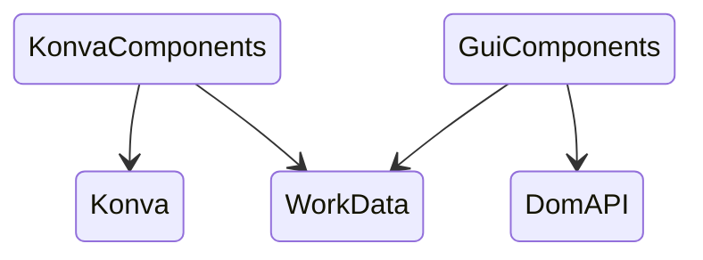

# Module Layers

# Intro

it's a state machine editor, which can save the graph as a json file.

# How to use

just open index.html by your browser.

the user manual is built in. 

# Konva

https://konvajs.org

