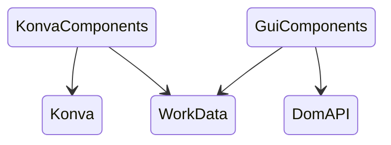

# Module Layers

```mermaid
stateDiagram-v2
    KonvaComponents --> Konva
    KonvaComponents --> WorkData
    GuiComponents --> WorkData
    GuiComponents --> DomAPI
```

# 覆盖流程

1. 创建
2. 删除
3. 重命名
4. 创建

# Konva

https://konvajs.org

