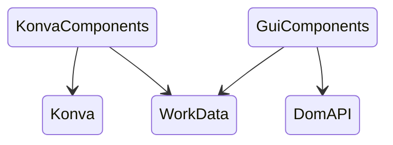

# Module Layers

```mermaid
stateDiagram-v2
    KonvaComponents --> Konva
    KonvaComponents --> WorkData
    GuiComponents --> WorkData
    GuiComponents --> DomAPI
```

# Intro

it's a state machine editor, which can save the graph as a json file.

# Konva

https://konvajs.org

